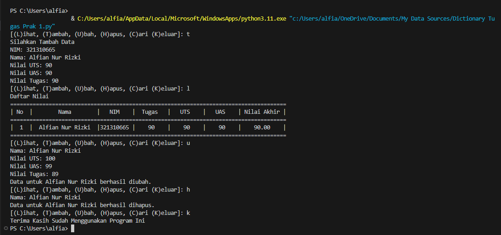

# Praktikum6

<h1>Latihan 1</h1>

Ubahlah Kode Dibawah Menjadi Lambda

  import math

  def a(x):
  return x**2

  def b(x, y):
  return math.sqrt(x**2 + y**2)

  def c(*args):
  return sum(args)/len(args)

  def d(s):
  return "".join(set(s))

<h1>Tampilan Program Lambda</h1>

<h1>Tampilan Output Lambda</h1>

<h1>Tugas Praktikum </h1>

Buat program sederhana dengan mengaplikasikan penggunaan fungsi
yang akan menampilkan daftar nilai mahasiswa, dengan ketentuan:

• Fungsi tambah() untuk menambah data

• Fungsi tapilkan() untuk menampilkan data

• Fungsi hapus(nama) untuk menghapus data berdasarkan nama

• Fungsi ubah(nama) untuk mengubah data berdasarkan nama

<h1>Tampilan Program Tugas Praktikum</h1>

<h1>Tampilan Output Tugas Praktikum</h1>

